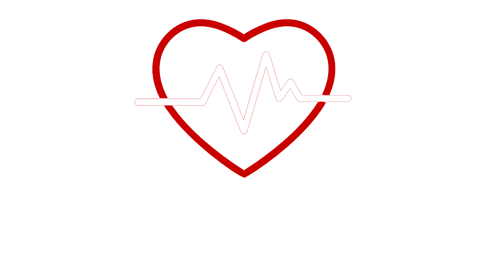

 * * *    * * *  

<h1 align="center">
 OpenClassrooms Application Developer Java Project 9
</h1>

 

  

<h2 align="center">
 OpenClassrooms Application Developer Java Project 9
</h2>

Mediscreen is an application that allows to detect a level of risk of diabetes in a patient, based on his age, his sex and the different notes left by the doctor

  

<h3>
 Features
</h3>

<ul>
<li>Be able to add patients, modify and delete them.</li>
<li>Add, edit and delete patient history notes.</li>
<li>Assess the level of risk of diabetes in patients using the content of the notes.</li>
</ul>