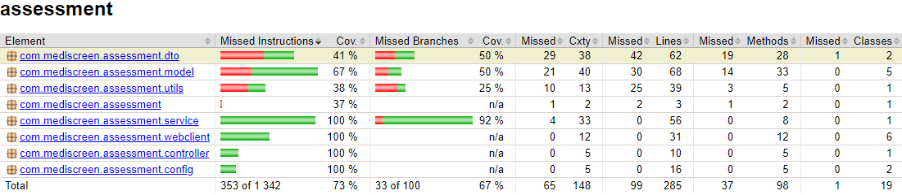

<p align="center">
 * * *    * * *   * * *  * * *   * * *  
</p>
<h1 align="center">
 OpenClassrooms Application Developer Java Project 9
</h1>

<p align="center">
 
</p>

<br><br>

<h2 align="center">
 OpenClassrooms Application Developer Java Project 9
</h2>

<p align="center">
Mediscreen is an application that allows to detect a level of risk of diabetes in a patient, based on his age, his sex and the different notes left by the doctor
</p>

<br><br>

<h3>
 Features
</h3>

<ul>
<li>Be able to add patients, modify and delete them.</li>
<li>Add, edit and delete patient history notes.</li>
<li>Assess the level of risk of diabetes in patients using the content of the notes.</li>
</ul>
<br>
<h3>
Run project :
</h3>

<h5>1° In /patient, /notes and /assessment, run the command : </h5>
``` $ mvn package  ```
<h5>2° Run docker : </h5>
``` $ docker-compose up  ```

<br>

<h3>
Test reports
</h3>

<h4>
To generate test reports, use command : 
</h4>

```$ mvn test  ```

<h4>
Microservice Patient : 
</h4>

<p align="center">
    
</p>

<h4>
Microservice Notes : 
</h4>

<p align="center">
    
</p>

<h4>
Microservice Assessment : 
</h4>

<p align="center">
    
</p>

<h3>
Test curls
</h3>

<p> Those curls are given by OpenClassrooms and can be used to test the app and add demo data : </p>

<h5> Sprint 1, patient's curls : </h5>

``` curl -d "family=TestNone&given=Test&dob=1966-12-31&sex=F&address=1 Brookside St&phone=100-222-3333" -X POST http://localhost:8081/patient/add ```

``` curl -d "family=TestBorderline&given=Test&dob=1945-06-24&sex=M&address=2 High St&phone=200-333-4444" -X POST http://localhost:8081/patient/add ```

``` curl -d "family=TestInDanger&given=Test&dob=2004-06-18&sex=M&address=3 Club Road&phone=300-444-5555" -X POST http://localhost:8081/patient/add ```

``` curl -d "family=TestEarlyOnset&given=Test&dob=2002-06-28&sex=F&address=4 Valley Dr&phone=400-555-6666" -X POST http://localhost:8081/patient/add ```

<h5> Sprint 2, note's curls : </h5>

``` curl -d "patId=1&Patient=TestNone &notes=Patient states that they are 'feeling terrific' Weight at or below recommended level" -X POST http://localhost:8082/patHistory/add ```

``` curl -d "patId=2&Patient=TestBorderline &notes=Patient states that they are feeling a great deal of stress at work Patient also complains that their hearing seems Abnormal as of late" -X POST http://localhost:8082/patHistory/add ```

``` curl -d "patId=2&Patient=TestBorderline &notes=Patient states that they have had a Reaction to medication within last 3 months Patient also complains that their hearing continues to be problematic" -X POST http://localhost:8082/patHistory/add ```

``` curl -d "patId=3&Patient=TestInDanger &notes=Patient states that they are short term Smoker " -X POST http://localhost:8082/patHistory/add ```

``` curl -d "patId=3&Patient=TestInDanger &notes=Patient states that they quit within last year Patient also complains that of Abnormal breathing spells Lab reports Cholesterol LDL high" -X POST http://localhost:8082/patHistory/add ```

``` curl -d "patId=4&=Patient=TestEarlyOnset &notes= Patient states that walking up stairs has become difficult Patient also complains that they are having shortness of breath Lab results indicate Antibodies present elevated Reaction to medication" -X POST http://localhost:8082/patHistory/add ```

``` curl -d "patId=4&=Patient=TestEarlyOnset &notes=Patient states that they are experiencing back pain when seated for a long time" -X POST http://localhost:8082/patHistory/add ```

``` curl -d "patId=4&=Patient=TestEarlyOnset&notes=Patient states that they are a short term Smoker Hemoglobin A1C above recommended level" -X POST http://localhost: 8082/patHistory/add ```

``` curl -d "patId=4&=Patient=TestEarlyOnset &notes= Patient states that Body Height, Body Weight, Cholesterol, Dizziness and Reaction" -X POST http://localhost:8082/patHistory/add ```


<h5> Sprint 3, assessment's curls : </h5>

``` curl -d "patId=1" -X POST http://localhost:8080/assess/id ```

``` curl -d "patId=2" -X POST http://localhost:8080/assess/id ```

``` curl -d "patId=3" -X POST http://localhost:8080/assess/id ```

``` curl -d "patId=4" -X POST http://localhost:8080/assess/id ```

``` curl -d "familyName=TestNone" -X POST http://localhost:8080/assess/familyName ```

``` curl -d "familyName=TestBorderline" -X POST http://localhost:8080/assess/familyName ```

``` curl -d "familyName=TestInDanger" -X POST http://localhost:8080/assess/familyName ```

``` curl -d "familyName=TestEarlyOnset" -X POST http://localhost:8080/assess/familyName ```